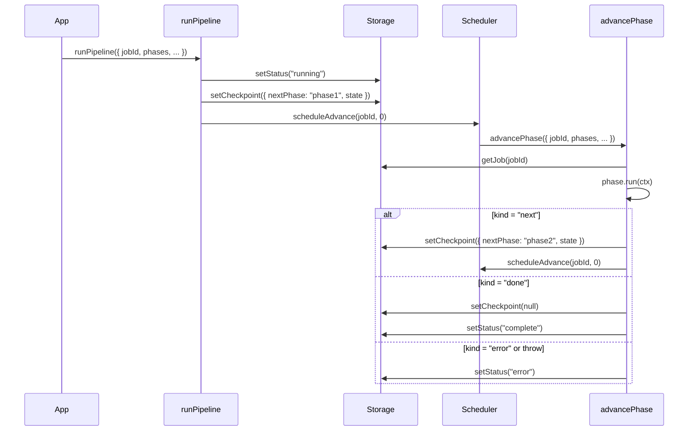

# Pipelines

## Lifecycle

Calling `runPipeline` does not execute any phase directly. It:

1. Resolves the starting phase name (using the checkpoint if `retryMode: "resume"`, otherwise the first phase in the array).
2. Writes `status: "running"` and the initial checkpoint to storage.
3. Calls `scheduler.scheduleAdvance(jobId, 0)` to queue the first phase execution.

When the scheduler fires, it calls `advancePhase`, which:

1. Reads the job's current checkpoint from storage.
2. Finds the matching `Phase` by name.
3. Runs `phase.run(ctx)`.
4. On `kind: "next"` — writes the new checkpoint and schedules another `advancePhase`.
5. On `kind: "done"` — clears the checkpoint and sets `status: "complete"`.
6. On `kind: "error"` — sets `status: "error"` (checkpoint is preserved for resume).
7. On throw — logs the error, sets `status: "error"`, and re-throws a `PhaseError` (checkpoint preserved).

### Sequence diagram



## `RunPipelineArgs`

```ts
type RunPipelineArgs<TState> = {
  /** Unique identifier for this pipeline run. */
  jobId: string;

  /** Ordered array of Phase objects. Must be non-empty. */
  phases: Phase<TState>[];

  /** Storage adapter for status, checkpoint, and logs. */
  storage: StorageAdapter<TState>;

  /** Scheduler adapter that triggers advancePhase. */
  scheduler: SchedulerAdapter;

  /**
   * Controls restart behaviour when a checkpoint already exists.
   * "resume" — start from the last checkpoint (default).
   * "full"   — discard the checkpoint and start from scratch.
   */
  retryMode?: "resume" | "full";

  /** State to use when no checkpoint exists (or retryMode is "full"). */
  initialState: TState;

  /**
   * Override the first phase name. Defaults to phases[0].name.
   * Ignored when retryMode is "resume" and a checkpoint exists.
   */
  initialPhase?: string;
};
```

## `AdvancePhaseArgs`

```ts
type AdvancePhaseArgs<TState> = {
  jobId: string;
  phases: Phase<TState>[];
  storage: StorageAdapter<TState>;
  scheduler: SchedulerAdapter;
};
```

`advancePhase` is the function your scheduler adapter calls. In production you register it as a Convex action or a queue handler; in tests you pass it to `scheduler._bind`.

## Full example

```ts
import type { Phase } from "@claritylabs/cl-pipelines";
import {
  runPipeline,
  advancePhase,
} from "@claritylabs/cl-pipelines";
import {
  createMemoryStorage,
  createMemoryScheduler,
} from "@claritylabs/cl-pipelines/adapters/memory";

type DocState = { text: string; wordCount?: number };

const extract: Phase<DocState> = {
  name: "extract",
  run: async (ctx) => {
    const words = ctx.checkpoint.state.text.split(/\s+/).length;
    await ctx.log(`extracted ${words} words`);
    return { kind: "next", nextPhase: "summarise", state: { ...ctx.checkpoint.state, wordCount: words } };
  },
};

const summarise: Phase<DocState> = {
  name: "summarise",
  run: async (ctx) => {
    await ctx.log(`summarising ${ctx.checkpoint.state.wordCount} words`);
    return { kind: "done" };
  },
};

const phases = [extract, summarise];
const storage = createMemoryStorage<DocState>();
const scheduler = createMemoryScheduler();

scheduler._bind((jobId) => advancePhase({ jobId, phases, storage, scheduler }));

await runPipeline({
  jobId: "doc-42",
  phases,
  storage,
  scheduler,
  initialState: { text: "Hello world from cl-pipelines" },
});

await scheduler.drain();

const jobs = storage._inspect();
console.log(jobs.get("doc-42")!.status); // "complete"
```
